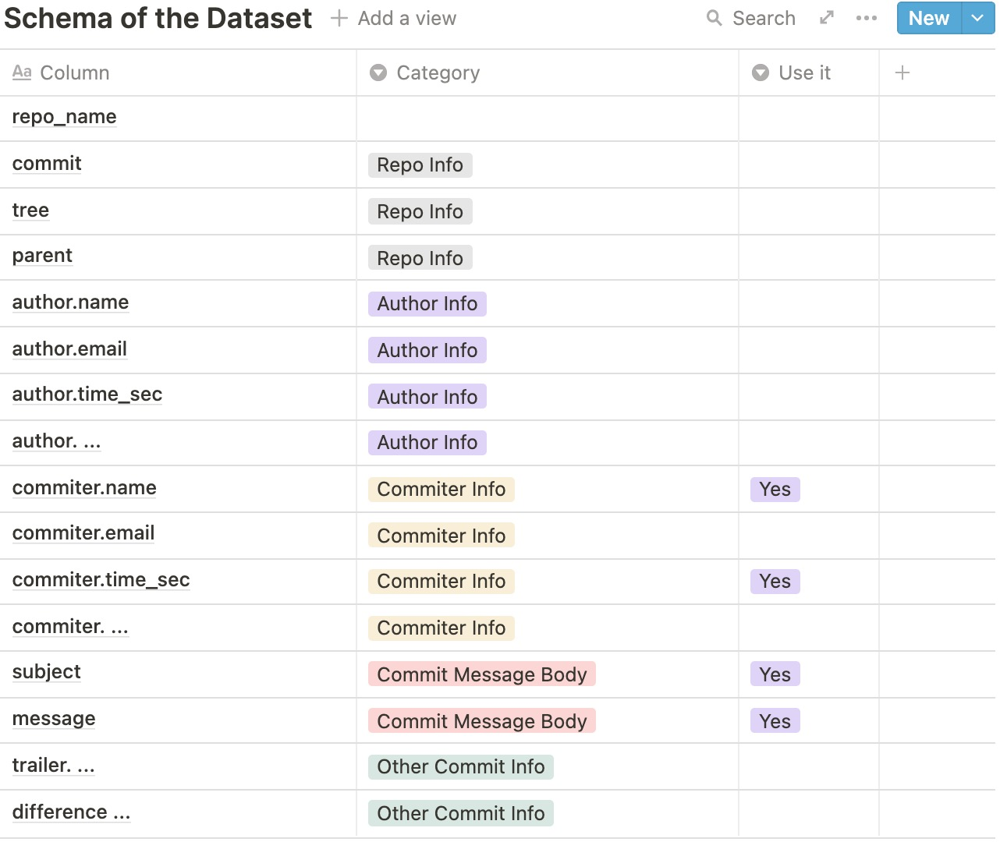
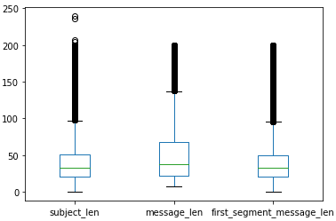
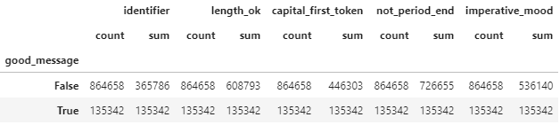
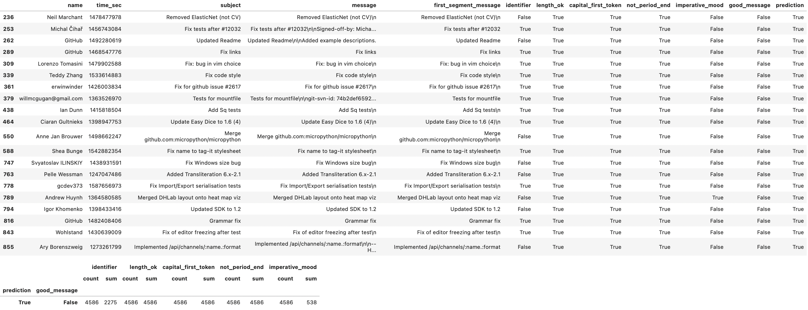
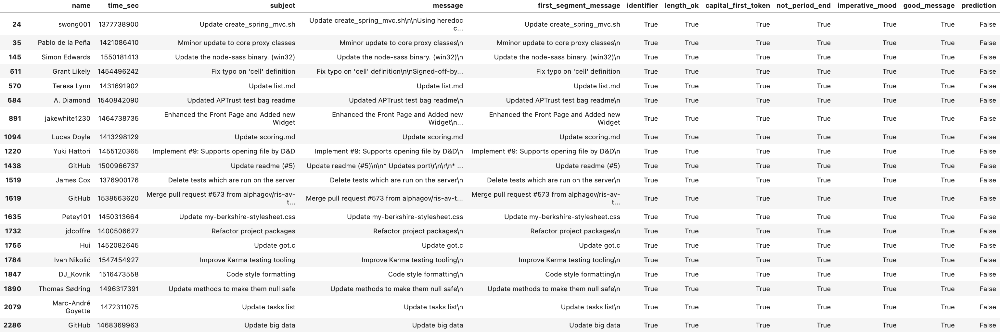

# Capstone Project Report

Chen Liang | For Machine Learning Engineer Nanodegree | 11.27.2020

## Overview

As a developer, we play with github nearly every day. It's highly likely that for a not-experienced developer, or a person that who didn't really care about using a good fashion of commit message, that we usually write bad commit message to our repo which there are tons of updates. These bad commit message, without the review from other team members or senior level person, makes the code base becoming confusing and hard for the people who is looking at it, making contributions, or even try to make contribution, or even taking it over, to understand.

[1][2] proposed couple gold rules or patterns of writing a good commit message, given that we have a huge commit message data source **Github**. In this project, we will try to make an NLP model which is aiming at giving general judgement on if people are writing a good or poor commit message, it will be helpful if people can correct or rectify their message before they really shoot the commit.

## Problem Statement

For this project, I will be mainly focus on creating a simple classification model which taking the commit message and subject as input, model will output a probabilty indicating if the commit message is a good one. Specifically, combining the knowledge from [2], a good commit message should obey the following rules:

1. Specify the type of commit:
    - `feat`: The new feature you're adding to a particular application
    - `fix`: A bug fix
    - `style`: Feature and updates related to styling
    - `refactor`: Refactoring a specific section of the codebase
    - `test`: Everything related to testing
    - `docs`: Everything related to documentation
    - `chore`: Regular code maintenance.[ You can also use emojis to represent commit types]
2. Separate the subject from the body with a blank line
3. Limit the subject line to 50 characters
4. Remove unnecessary punctuation marks
5. Do not end the subject line with a period
6. Capitalize the subject line and each paragraph
7. Use the imperative mood in the subject line

I would need to convert the whole commit body to the text or statistical features and train a small neural network model to output the probability.

## Data Analysis

As mentioned in [4], Google Bigquery is now the place that stores and expose the commit messages data to the public, thus, I will be using it as our data source. In order to successfully acquire the data, I would need to register the authentication and acquire the credential file before I can make queries in the sagemaker notebook instance.



As mentioned in this table, I will use commiter's name, commit time as Identifier, subject and message as feature. As of the dependent variable, I will use the following rules to create:

- If it has the identifier of the commit message like (fix, update, etc.)
- If the commit subject is over length
- If first not symbol character of commit message is capitalized
- If the commit subject is not end up with period
- If the POS for the first all-alphabet-chars token of the commit message corresponds to a verb

### Overview of the Dataset

Specifically, this is the google big query that I've used, considering the trade-off betIen cost and capability, I fetched the first 1M records from the commit message table.

In addition to this, considering that some commit message is too small or large, which will hugely impact the size of the dataset file and difficulty that I read, by manually reviewing those super long commit message, they are more likely presenting a technical detail, which I don't think should be seriously considered in this project, so I set 6 and 200 as threshold for filtering the length of the text.

```sql
SELECT committer.name, committer.time_sec, subject, message
FROM `bigquery-public-data.github_repos.commits`
WHERE LENGTH(message) > 6 AND LENGTH(message) <= 200
LIMIT 1000000
```
### Text Features

By checking the commit subject and message body, here are some information about the dataset and feature quality, among 1M records

- There are 0 null-values in the records that I fetched, for both subject and message.
- 10.95% of the subjects are same as the commit messages.
- Picking `\n\n` as delimiter to split the commit message into segments, there are 20.33% messages has multiple segments, and there are 30.65% subjects are identical to the first segment of commit messages.

The length distribution of the subject, full message, and first segment of the message is shown in the following graph



### Label Distribution

According to the previous section, I use the following rules to filter out the good commit message:

- **Identifier**: The "commit identifiers", including `{'implement', 'polish', 'remove', 'refactor', 'add', 'fix', 'rework', 'rename', 'resolve', 'merge', 'update'}` , at least one of them existed in the subject or first segment message
- **Length_ok**: Commit subject is less then 50 characters
- **Not_period_end**: No period in the end of the subject
- **Imperative_mood**: First all-alphabet character token in subject is a verb
- **Capital_first_token**: The first token of commit subject and first segment message is capitalized

If all five rules are satisfied, this commit message would be tagged as a good message, given these rules, the label distribution shows in the belowing table:



Around 1/10 Samples are good messages, identifier rule is the most difficult rule to satisfy, which there are only around 36% samples match the requirement.

## Algorithms

In total, including the way I create the dependant variable, I've used three ways to estimate if a commit message is a good one, specifically I have
1. A rule based system (as our benchmark)
2. A binary classification model based on the rule feature (as another benchmark)
3. A neural network which ingests some of the rule-basd feature and text features as input (as our experiment model structure)

### Benchmark Models

#### Rule Based System

As described in previous section, I created 5 rule feature for a commit message, the rule based system basically announce that the commit message will be a good one if this commit message body (including subject) satistifed all the rule feature. 

The advantage of this system is that the implementation is pretty easy, and the result is easily explainable, while on the other side, given that I have a limited amount of identifier, and the imperative mood is not as easy to judge as I use this rule, I may lose a large amount of good commit message.

#### LinearLearner from Sagemaker

For this benchmark model, I simply takes the rule feature and feed to a `LinearLearner` which I expect to create a binary classifier from it. I didn't dig into ther performance evaluation it for too much given that the best of what it can reach is to reach the same performance level to the rule-based system. And given that it's using the exact same input feature, it won't help if I expect to have the ansIr to some questions like, if there will be a chance that the rule based system is wrong.

### Methodology to Create Experiment Model

Given that I have less confidence that rule-based feature `identifier` and `imperative_mood` is a good one since there must be some cases that human may missed out, for the experimental model, the neural network is designed to ingest both text feature (including the subject and first segment of commit message) and some of the reliable rule based features (like captialization, no period end, and length qualification). 

I will provide more details in the following sub-sections. In summary, I are taking the following five features:
- subject text (--> sequence)
- first segment commit message text (--> sequence)
- length_ok (--> binary)
- not period end (--> binary)
- capital first token (--> binary)

#### Data Preprocessing

As I need to ingest text feature, I need to sequentialize the texts for both subject and first segment commit message. Given the limitation of computation poIr, instead of using two seperate tokenizer for each of them, I used one tokenizer to fit both two text features. 

By inspecting the training set, I have recognized that there are 243430 unique tokens, I don't want to include all of them into the tokenizer because its generally not a realistic strategy since the space of token will be huge if the corpus size increase. 100000 is the number I choose for the tokenizer

Using this code snippet, I've successfully created the tokenizer that I expected.

```python
tokenizer = Tokenizer(num_words=100000, loIr=True, oov_token="<unk>")
```
After initializing the tokenizer, a feature convert process is created to transform the text into a padded sequence, the following code snippet is used to handle this task. After the text feature has been handled, I concatenate these features with rule features, and make the final array for training.

```python
MAX_LEN = 200 # As I did the cut-off from the data acquiring stage

TRANSFORMED_FEATURES_DICT[col] = pad_sequences(tokenizer.texts_to_sequences(focus_texts), maxlen=MAX_LEN, padding="post", truncating="post")
```

#### Create Model

On the aspect of model, I create the model having the following workflow

1. Split the input tensor into two parts, one for text features (dimenion is 400, 200 for each feature), the other part for rule feature (dimension is 3). This is because our input file that I used for sagemaker training job is a csv which concatenated two parts together, now I want to split them out
2. For the text feature, go through a trainable embedding layer and global max pooling layer to reduce the dimension back to 1D. The goal of producing these two layers are A. convert the text feature to an embedding vector which may capture the semantic information hidden from these sentence B. Reduce the dimension of vector to a proper size which can be used to concatenate with rule features
    - **Why don't I use the pre-trained embedding?** I think the language we used for commit message is more likely to be domain specific, thus, using a pre-trained embedding model which fit on the daily used language may not be a good strategy.
3. Concatenate two parts of features, go through a small fully connected layer, then output a sigmoid value of this layer as the prediction.

#### Pros and Cons for Model

This model architecture has two feature advantage:
- Thanks to the customized embedding layer, this model can support a very domain specific task and capture the special meaning of some identifiers like 'style', 'feat' and 'chrore'
- The dimension reduction then concatenate strategy is a good strategy for feature fusion

There are also cons for this model, including:
- The customized, trainable embedding layer weight can introduce a large amount of time in training phase
- Though we have dimension reduction, the dimension for rule-feature is such small that it's hard to make them producee significant impact

## Results

For model evaluation, I compared the precison, recall, and count of samples that falls into False-Positive and False-Negative area. Specifically for the experiemental neural network, I dig deeper into the results to check for those misaligned samples, why the nerual network failed to align, is it because of the failure of the neural network, or there are indeed some samples that the rule-based system failed to capture.

### Metrics Comparison

The following table shows the performance against the rule based system

| Model | Alignment (Acc) | Precision | Recall | FP-Samples | FN-Samples | 
|-------|-----------------|-----------|--------|------------|------------|
| Rules | 100% | Benchmark | Benchmark | Benchmark | Benchmark |
| LinearLearner | 97.3% | 83.1% | 100% | 6859 | 0 |
| Neural-Network | 96.6% | 86.7% | 88.7 | 4586 | 3831 |

It's obvious that the linear has closer alignment to the rule based system, given that this model is using the exact same feature as the rule-based system did. However, there are still some samples that this binary classifier failed to align, which means there will be still hidden information, which should be required by linearlearner to use, in order to give a good prediction.

Compared to LinearLearner Model, neural network used 3.6% precision in exhanged of 10% recall, however, it's likely that there some samples that the rule-based system missed out. We will need to take a deep look into those samples.

### Analysis on Misalign

I take a deep look into the false positive and false negative samples, here are some observations corresponding to them.

#### False Positive Samples
The following picture shows the first 15 samples which identified as False Positive, along with the statistics for all the FP sampeles, the `prediction` column is the prediction from neural network, `good_message` column is the label created from rule-based system.

We may observed from the statistics that among the FP samples, all the cases are related to either the imperative mood or identifier rule failed to satisfied, which belongs to the case that we mentioned, there is a chance that the rule-base system missed out something. As you review these 15 samples, I think they are make sense from human perspective, since they are related to mentioning the fixing, implementation and remove stuff. We have to review more samples to confirm our suspect but it will be promising that the neural network actually captured the commit message that the rule-based system didn't find.



#### False Negative Samples
Speaking to the False Negative samples, seems like most of the commit message (at least from the first 15 samples) belongs to update. Thus my suspicion is that the embedding vector for update can be messed up, or it has been encoded to <unk> given the limitation of the vocabs the next step is to acquire more observations to find out if there is a pattern for these errors, then check how the text feature being encoded or transformed of those commit messages



## Refinement and Conclusion

In summary, we have the following conclusion:
- Using neural network is a practical way to build a general good classifier for distinguish the good and bad commit message
- Compared to the rule-based system, neural network model is easy to maintain, and indeed captured more valid cases that the rule-based system couldn't.
- However, the neural network model also failed to capture some good commit messages, given that it's hard to explain so far, we have to make deeper look into the misclassified samples to find out why.

In futurework, there are some additional idea which can be implemented in order to increase the accuracy of the whole system:
1. Use nerual network to build a raw classifier, and then use the rules as post-processing.
2. Use more complex model architecture, like textCNN or RNN to process the text feature, but it may require more data comes in.

## Reference

[1] [https://chris.beams.io/posts/git-commit/#separate](https://chris.beams.io/posts/git-commit/#separate)

[2] [https://www.freecodecamp.org/news/writing-good-commit-messages-a-practical-guide/](https://www.freecodecamp.org/news/writing-good-commit-messages-a-practical-guide/)

[3] [https://datascience.stackexchange.com/questions/58372/extract-imperative-sentences-from-a-documentenglish-using-nlp-in-python](https://datascience.stackexchange.com/questions/58372/extract-imperative-sentences-from-a-documentenglish-using-nlp-in-python)

[4] [https://github.blog/2017-01-19-github-data-ready-for-you-to-explore-with-bigquery/](https://github.blog/2017-01-19-github-data-ready-for-you-to-explore-with-bigquery/)

[5] [https://towardsdatascience.com/accuracy-precision-recall-or-f1-331fb37c5cb9](https://towardsdatascience.com/accuracy-precision-recall-or-f1-331fb37c5cb9)
